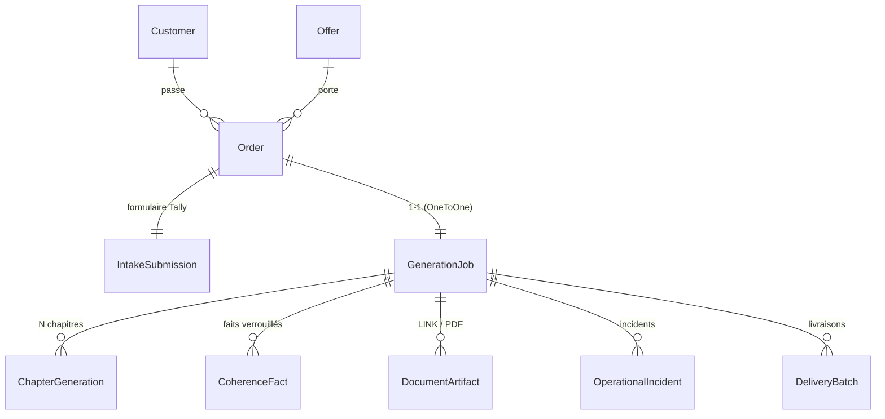
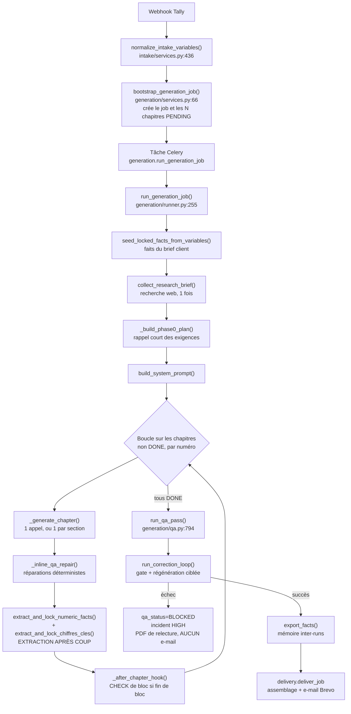

# Cartographie du moteur de génération — Système EVKHA

**Étape 0 du plan de refonte. Document de lecture seule : aucun fichier du projet n'a été modifié.**

- Dépôt analysé : `EVKHA-SVG/Systeme-EVKHA`, branche `main`, commit `dc8d64d`
- Date de l'analyse : 29 juillet 2026
- Périmètre : moteur de génération et rendu documentaire uniquement

---

## Avertissement liminaire — le diagnostic du cahier des charges ne correspond pas au code

La règle 10 du cahier des charges demande de signaler immédiatement tout écart entre le problème décrit et le problème réel. Cet écart existe, et il est structurant. Il est détaillé en **section 7** ; en voici le résumé, à lire avant tout le reste.

| Affirmation du cahier des charges | Ce que dit le code |
|---|---|
| « Les 22 chapitres sont générés par 22 appels séparés » | 28 appels de rédaction pour une étude de marché, plus 11 appels de contrôle, plus les reprises. Le compte exact est en 4.3. |
| « Chaque appel repart d'une page blanche » | **Faux.** Chaque appel reçoit les faits verrouillés, les résumés des chapitres précédents, le tableau des chiffres-fondations et le brief client. Voir `generation/context.py:111`. |
| « Il ne connaît ni les chiffres ni les conclusions des chapitres précédents » | Ils lui sont transmis. Le défaut est ailleurs : **le socle est déduit après coup du texte produit, par expressions régulières**, au lieu d'être établi avant. Voir 7.1. |
| Solution : un socle de données verrouillé | **Déjà présent** sous une forme dégradée : modèle `CoherenceFact`, module `coherence.py` (51 ko). Ce qui manque est son typage, sa production en amont et sa correction manuelle. |
| Solution : une passe de vérification | **Déjà présente** : `gate.py` (58 ko), 15 contrôles, dont un qui compare précisément les chiffres du texte au socle. |
| Sortie : Word et PDF | **Aucune génération Word n'existe.** `python-docx` n'est pas une dépendance. La valeur `DOCX` du modèle `DocumentArtifact` n'est jamais produite. Voir 6.3. |

**Conséquence sur le plan de livraison.** Les lots 1, 2 et 4 ne sont pas des créations : ce sont des refontes de code existant et testé. Le lot 3 (rendu Word) est, lui, une création intégrale et représente à mon estimation la plus grosse part de l'effort. L'ordre de livraison proposé reste valable, mais la répartition de la charge est inverse de celle que le document laisse supposer.

---

## 1. Arborescence commentée

### 1.1 Applications Django (`backend/`)

| Application | Rôle | Hors périmètre |
|---|---|---|
| `catalog` | Offres commerciales, types de livrables, mode de livraison, rétention. | oui |
| `customers` | Clients, abonnements B2B, tickets de crédits. | oui |
| `orders` | Commandes, rattachement client/offre, périodes mensuelles. | oui |
| `intake` | Réception et normalisation des formulaires Tally, extraction des données financières. | partiellement |
| **`generation`** | **Moteur de génération. Cœur du périmètre de la mission.** | non |
| **`documents`** | **Assemblage du livrable, contrôle de fidélité du rendu, artefacts.** | non |
| `delivery` | Envoi Brevo, purge des artefacts, contrôle de fidélité Gamma. | oui |
| `integrations` | Adaptateurs externes : Claude, Brevo, Gamma, PDF, recherche web, webhooks. | partiellement |
| `monitoring` | Incidents opérationnels. | oui |
| `dashboard` | API REST du tableau de bord (28 routes), authentification par jeton. | oui |
| `core` | Modèle de base `UUIDModel`, utilitaires numériques partagés. | partiellement |
| `evkha` | Configuration Django, Celery, URLs. | oui |

### 1.2 Modules de l'application `generation`

C'est là que se joue la mission. Volume total : environ 480 ko de Python.

| Module | Taille | Rôle |
|---|---|---|
| `runner.py` | 34 ko | Orchestrateur. Boucle sur les chapitres, découpe en sections, reprises, déclenche les contrôles inter-blocs. |
| `blueprints.py` | 21 ko | Chapitrage déclaratif des quatre livrables : numéro, titre, clé de prompt, sections, cible de mots, modèle, exécution de code. |
| `prompt_library.py` | **98 ko** | Bibliothèque des prompts, un dictionnaire Python géant indexé par clé de chapitre. |
| `prompts.py` | 25 ko | Assemblage du prompt système et du prompt utilisateur. |
| `context.py` | 10 ko | Construction du contexte injecté à chaque appel (faits, résumés, sources, brief). |
| `coherence.py` | 51 ko | Extraction, verrouillage et exposition des faits chiffrés. Contrôles TAM/SAM/SOM. |
| `gate.py` | 58 ko | Barrière de livraison. 15 contrôles bloquants. |
| `qa.py` | 42 ko | Passe de qualité post-génération : détection de violations, réparations déterministes, réparation par IA. |
| `checks_blocs.py` | 36 ko | Contrôles inter-blocs du manuel EVKHA : 11 blocs, appel Claude dédié par bloc. |
| `checks_evangeline.py` | 28 ko | Détecteurs métier : fourchettes, divergences chiffrées, chapitres avortés, comptage des concurrents. |
| `checks_post_rendu.py` | 31 ko | Détecteurs après rendu : troncatures, doublons de titres, sources non traçables, ton publicitaire, prudence juridique. |
| `rendering.py` | 44 ko | Markdown vers HTML, nettoyage éditorial, image de marque, découpage des tableaux longs. |
| `visuals.py` | 31 ko | Bibliothèque d'icônes SVG et ruptures visuelles insérées par position. |
| `charts.py` | 16 ko | Graphiques SVG rendus côté serveur : barres, barres horizontales, camembert, radar. |
| `correction.py` | 13 ko | Boucle d'auto-correction : régénère les chapitres fautifs signalés par la barrière. |
| `cost.py` | 12 ko | Moteur de coûts : tarification, plafonnement strict, répartition du budget par appel. |
| `validation.py` | 11 ko | Contrôles immédiats sur un chapitre : tableaux vides, troncature, encadrés déséquilibrés, jetons non résolus. |
| `reference_em.py` | 10 ko | Extraits verbatim d'une étude de référence, injectés comme exemples. |
| `research.py` | 7 ko | Collecte de sources web au démarrage du job. |
| `blocks.py` | 9 ko | **Code mort.** Voir 7.4. |
| `fact_store.py` | 5 ko | Mémoire inter-études : réutilisation des repères d'un run précédent, même secteur et pays. |
| `substitution.py` | 4 ko | Jetons `{{nom}}` remplacés par la valeur exacte du brief avant livraison. |
| `geography.py` | 4 ko | Zone macro et consignes géographiques déduites du pays. |
| `internal_labels.py` | 3 ko | Liste unique des étiquettes internes à ne jamais laisser fuiter. |
| `strategies/` | 43 ko | Une stratégie par livrable : contexte supplémentaire, consignes spécifiques. |

---

## 2. Dépendances et versions

### 2.1 Socle obligatoire (`pyproject.toml`)

| Paquet | Contrainte | Observation |
|---|---|---|
| Python | `>= 3.12` | À jour. |
| Django | `>= 5.2, < 6` | À jour. |
| Celery | `>= 5.4, < 6` | À jour. |
| `psycopg[binary]` | `>= 3.2, < 4` | À jour. |
| `redis` | `>= 5, < 6` | À jour. |
| `pydantic` | `>= 2, < 3` | Déclaré pour `blocks.py`, qui n'est importé nulle part. |
| `django-environ` | `>= 0.11, < 1` | À jour. |
| `gunicorn` | `>= 22, < 24` | À jour. |

### 2.2 Extras optionnels

| Extra | Contenu | Observation |
|---|---|---|
| `ai` | `anthropic >= 0.40, < 1` | **Point de vigilance.** La borne haute autorise n'importe quelle version 0.x. Le SDK a connu des changements de surface d'API entre 0.40 et les versions récentes. Aucun verrouillage de version dans le dépôt. |
| `search` | `ddgs`, `httpx` | Recherche gratuite DuckDuckGo, Tavily en option payante. |
| `pdf` | `weasyprint 62.x`, `pydyf < 0.12`, `beautifulsoup4`, `pypdf` | `pydyf` est épinglé sous 0.12 parce que 0.12 casse l'API `transform()` utilisée par WeasyPrint 62. WeasyPrint 62 date de 2024 : montée de version à prévoir, mais hors périmètre. |
| `dev` | `pytest`, `pytest-django`, `mypy strict`, `ruff`, `django-stubs` | Outillage complet et bien configuré. |

**Absent et nécessaire au lot 3 : `python-docx` (ou `docxtpl`).** Aucune bibliothèque Word n'est présente dans le projet.

### 2.3 Modèle Claude et paramètres d'appel

- Alias configuré : `EVKHA_CLAUDE_MODEL=claude-sonnet`, résolu vers `claude-sonnet-4-6` (`integrations/claude.py:13`).
- `_DEFAULT_MAX_TOKENS = 8192` (`integrations/claude.py:26`).
- Réflexion **adaptative** activée sur tous les appels de génération : `thinking: {type: "adaptive"}` accompagné de `output_config: {effort: …}` (`EVKHA_CLAUDE_EFFORT`, « high » par défaut). `EVKHA_THINKING_BUDGET_TOKENS=1024` n'est plus transmis à l'API : c'est désormais une **provision** interne, réservée dans `max_tokens` et provisionnée par le throttle (`_provision_reflexion`).
- La réflexion est toujours **explicite**, jamais omise. Sur les modèles récents, omettre `thinking` ne l'éteint pas : elle tourne en adaptatif. `complete_structured` la coupe donc par `thinking: {type: "disabled"}`, et non plus par silence.
- Mise en cache du prompt système avec durée de vie d'une heure (`_cacheable_system`, `integrations/claude.py:583`).
- Outil `advisor` sur cinq blocs de contrôle, en-tête bêta `advisor-tool-2026-03-01`.
- Outil d'exécution de code sur le seul chapitre 2 de l'étude de marché.
- Continuation automatique sur `stop_reason: max_tokens`, plafonnée à `_MAX_CONTINUATIONS = 2`.

**Point de vigilance levé le 05/08/2026.** Ce paragraphe signalait que `budget_tokens` était un mode hérité, refusé par les modèles récents, et qu'une bascule de modèle imposerait de reprendre le code. C'est fait : le passage en réflexion adaptative est intégré, et le code n'envoie plus `budget_tokens`. Sans cette reprise, `claude-sonnet-5` aurait renvoyé une erreur 400 sur **chaque** appel — pas une dégradation, un arrêt complet.

**Ce qui reste à faire pour la bascule.** Une seule variable Coolify : `EVKHA_ANTHROPIC_MODEL_ID=claude-sonnet-5`. L'alias `EVKHA_CLAUDE_MODEL` reste `claude-sonnet` ; la tarification se résout par famille (`generation/cost.py::_pricing`), donc le tarif Sonnet s'applique sans autre changement — Sonnet 5 est facturé au même prix que Sonnet 4.6.

**Ce que la bascule change réellement.** Pas le tarif, mais le **tokenizer** : le même texte compte environ 30 % de tokens en plus. Les budgets de `_BUDGET_EUR_BY_TYPE` ont été relevés d'autant. Ces valeurs restent une projection tant qu'aucune génération réelle n'a tourné sur Sonnet 5 (règle 7 : le vert des tests ne prouve rien sur le document livré).

---

## 3. Modèles Django impliqués dans la génération

### 3.1 Relations



### 3.2 Où sont stockées les données produites

| Donnée | Emplacement | Type | Fichier |
|---|---|---|---|
| Texte d'un chapitre | `ChapterGeneration.content` | `TextField` — **texte libre, Markdown mêlé de HTML** | `generation/models.py:101` |
| Résumé d'un chapitre | `ChapterGeneration.operational_summary` | `TextField`, plafonné à 1 200 caractères | `generation/models.py:102` |
| Fait chiffré | `CoherenceFact` | `key` et `value` en `CharField`, **valeur stockée sous forme de chaîne** | `generation/models.py:122` |
| Provenance d'un fait | `CoherenceFact.provenance` | `client` (intangible) ou `generated` (extrait du texte) | `generation/models.py:129` |
| Fiche sectorielle | `GenerationJob.context_summary` | `TextField` libre | `generation/models.py:72` |
| Brief de recherche web | `GenerationJob.research_brief` | `TextField` libre | `generation/models.py:79` |
| Plan de phase 0 | `GenerationJob.phase0_plan` | `TextField` libre | `generation/models.py:73` |
| Coût et jetons | `ChapterGeneration.input_tokens`, `output_tokens`, `cost_eur` | Numériques | `generation/models.py:103` |
| Artefacts | `DocumentArtifact` | `kind` ∈ {`docx`, `pdf`, `gamma_pdf`, `gamma_pptx`, `link`} | `documents/models.py:24` |

**Ce qui n'est stocké nulle part** : la structure d'un chapitre (sections, tableaux, graphiques), la liste des identifiants de données qu'un chapitre utilise, la spécification d'un graphique. Tout cela n'existe que fondu dans la chaîne `content`.

### 3.3 Le modèle `CoherenceFact`, socle actuel

C'est l'équivalent existant du socle demandé au lot 1. Ses limites, par rapport à la structure cible du cahier des charges :

| Champ attendu (§5.2) | Présent ? | Commentaire |
|---|---|---|
| `id` stable | partiel | `key` est un texte normalisé, dérivé du libellé rencontré dans la prose. Il n'est pas issu d'un référentiel fermé. |
| `libelle` | non | Confondu avec `key`. |
| `valeur` numérique | **non** | `value` est un `CharField(500)`. La valeur numérique est reparsée à chaque usage par `core/numbers.py`. |
| `unite` | non | Incluse dans la chaîne `value`. |
| `annee` | non | Parfois incluse dans `value`, parfois absente. |
| `perimetre` | partiel | Déduit par expression régulière du contexte de la phrase (`_classer_niveau`, `coherence.py:152`). |
| `source` | non | Aucun champ. |
| `fiabilite` | partiel | `provenance` distingue le brief client du contenu généré, ce qui n'est pas la même notion. |

Le modèle porte en revanche deux garanties utiles à conserver : une contrainte d'unicité `(job, kind, key)` et une gestion explicite des conflits (`upsert_locked_fact`, `coherence.py:286`).

---

## 4. Le pipeline actuel, de bout en bout

### 4.1 Schéma



### 4.2 Chaque étape, son fichier et sa fonction

| # | Étape | Fichier et fonction | Exécution |
|---|---|---|---|
| 1 | Réception du formulaire | `intake/services.py` → `normalize_intake_variables()` ligne 436 | synchrone (webhook) |
| 2 | Création du job et des chapitres | `generation/services.py` → `bootstrap_generation_job()` ligne 66 | synchrone |
| 3 | Lancement | `generation/tasks.py` → `run_generation_job_task()` ligne 51 | **Celery** |
| 4 | Amorçage des faits client | `generation/coherence.py` → `seed_locked_facts_from_variables()` ligne 416 | dans la tâche |
| 5 | Recherche web | `generation/research.py` → `collect_research_brief()` ligne 121 | dans la tâche, une fois |
| 6 | Prompt système | `generation/prompts.py` → `build_system_prompt()` ligne 278 | dans la tâche |
| 7 | Boucle chapitres | `generation/runner.py` → `run_generation_job()` ligne 255 | **séquentielle** |
| 8 | Un chapitre | `generation/runner.py` → `_generate_chapter()` ligne 498 | 1 à 3 appels |
| 9 | Chapitre découpé | `generation/runner.py` → `_generate_chunked()` ligne 415 | 1 appel par section |
| 10 | Validation immédiate | `generation/validation.py` → `validate_chapter_content()` ligne 258 | déterministe |
| 11 | Reprise ciblée | `runner.py:478` et `runner.py:568` | 1 reprise maximum |
| 12 | Extraction des faits | `generation/coherence.py` lignes 769 et 1140 | déterministe, par regex |
| 13 | Contrôle de bloc | `generation/checks_blocs.py` → `check_bloc()` ligne 705 | **1 appel Claude par bloc** |
| 14 | Passe qualité | `generation/qa.py` → `run_qa_pass()` ligne 794 | déterministe, puis IA si besoin |
| 15 | Barrière et correction | `generation/correction.py` → `run_correction_loop()` ligne 204 | 1 ronde par défaut |
| 16 | Barrière seule | `generation/gate.py` → `run_delivery_gate()` ligne 1264 | déterministe |
| 17 | Assemblage | `documents/services.py` → `assemble_document()` ligne 168 | synchrone dans la tâche |
| 18 | Livraison | `delivery/tasks.py` → `deliver_job_task()` ligne 16 | **Celery** |
| 19 | Gardien des jobs bloqués | `generation/tasks.py` → `reset_stuck_generation_jobs()` ligne 17 | **Celery beat**, horaire |
| 20 | Purge des artefacts | `delivery/tasks.py` → `purge_expired_artifacts_task()` ligne 36 | **Celery beat**, horaire |

### 4.3 Décompte réel des appels API pour une étude de marché

Le cahier des charges annonce 22 appels. Le décompte issu de `blueprints.py` :

| Origine | Nombre |
|---|---|
| Chapitres non découpés (0, 2 à 9, 11 à 13, 15 à 18, 20, 21) | 20 |
| Chapitre 1, découpé en 2 sections | 2 |
| Chapitre 10, découpé en 3 sections | 3 |
| Chapitre 14, découpé en 3 sections | 3 |
| Chapitre 19, découpé en 2 sections | 2 |
| **Sous-total rédaction** | **28** |
| Contrôles de bloc (INITIAL, puis A à J) | 11 |
| **Sous-total nominal** | **39** |
| Reprises de validation | jusqu'à +28 |
| Réparation IA de la passe qualité | variable |
| Boucle de correction | variable |

Le budget configuré est de **4,60 € pour l'étude de marché** (`generation/services.py:55`), et non 2,60 €. Le plafond de 2,60 € évoqué dans les échanges correspond à un état antérieur du dépôt.

### 4.4 Ce qui est synchrone, ce qui passe par Celery

- **Celery** : lancement de la génération, livraison, génération de PDF pour job en échec, envoi d'e-mail, purge, gardien des jobs bloqués.
- **Synchrone dans la tâche Celery** : toute la boucle des chapitres, les contrôles de bloc, la passe qualité, la barrière, l'assemblage du document. Un job d'étude de marché est donc **une seule tâche Celery longue**, de l'ordre de 20 à 30 minutes selon le journal des générations.
- **Aucun parallélisme** entre chapitres. La boucle est strictement séquentielle, par nécessité : chaque chapitre lit les résumés et les faits des précédents.

---

## 5. Inventaire des prompts

### 5.1 Où ils vivent

**Tous les prompts sont dans le code Python.** Aucun fichier de prompt versionné séparément.

| Emplacement | Contenu |
|---|---|
| `generation/prompt_library.py` (98 ko) | Dictionnaire `PROMPTS: dict[str, str]` indexé par clé (`em.01.a.mondial`, `bp.14.investissements`…). Une entrée par chapitre ou section. |
| `generation/prompts.py` | Assemblage : `build_system_prompt()`, `build_chapter_prompt()`, `build_section_prompt()`, consignes par livrable. |
| `generation/context.py` | `ROLE_LINE` : bloc de rôle et de contraintes, environ 3 500 caractères en dur, ligne 19. |
| `generation/reference_em.py` | Extraits verbatim d'une étude de référence, utilisés comme exemples. |
| `generation/checks_blocs.py` | Prompts des contrôles inter-blocs, avec questions verbatim du manuel. |
| `generation/strategies/*.py` | Contexte supplémentaire par type de livrable. |
| `generation/qa.py` | Prompts de réparation par IA. |

### 5.2 Comment le prompt est assemblé

Deux parties.

**Prompt système** — `build_system_prompt(deliverable_type, country, plan)`, mis en cache une heure, identique sur tous les appels d'un job :
consignes d'écriture EVKHA, charte typographique, consigne géographique déduite du pays, consigne spécifique au livrable, plan de phase 0.

**Prompt utilisateur** — `build_chapter_prompt(chapter)` puis `build_context(chapter)` (`context.py:111`), reconstruit à chaque appel, dans cet ordre :

| Bloc | Source |
|---|---|
| `ROLE_LINE` | constante, `context.py:19` |
| `DATE_DU_JOUR` | `_date_line()` |
| `VARIABLES_PROJET` | `IntakeSubmission.normalized_variables`, sérialisé en JSON |
| `FICHE_SECTORIELLE` | `job.context_summary` |
| `SOURCES_WEB` | `job.research_brief` |
| `DONNEES_CLIENT` | faits de provenance `client` |
| `CHIFFRES_A_CITER` | catalogue des jetons de substitution |
| `REPERES_DEJA_ENONCES` | faits de provenance `generated` |
| `FAITS_REFERENCES` | mémoire inter-runs, **chapitre 1 uniquement** |
| `CHIFFRES_FONDATIONS` | tableau formaté, **étude de marché uniquement** |
| `RESUME_OPERATIONNEL_PRECEDENT` | concaténation des résumés des chapitres précédents |
| `CHAPITRE_CIBLE`, `PROMPT_KEY` | identification |
| Supplément de stratégie | `strategies/*.contexte_supplementaire()` |

C'est ce bloc qui contredit l'affirmation « chaque appel repart d'une page blanche ». Le contexte est riche ; le problème est la **nature** de ce qu'il contient, pas son absence.

### 5.3 Paramètres d'appel

| Paramètre | Valeur | Emplacement |
|---|---|---|
| `model` | `claude-sonnet-4-6` | `integrations/claude.py:13` |
| `max_tokens` | calculé, borné entre 2 500 et 8 192 | `cost.py:168` |
| `thinking` | `enabled`, 1 024 jetons, sur tous les appels | `claude.py:432` |
| `cache_control` | `ephemeral`, TTL 1 h, sur le prompt système | `claude.py:583` |
| `tools` | `advisor` sur 5 blocs, `code_execution` sur le chapitre 2 EM | `claude.py:445` |
| `betas` | `advisor-tool-2026-03-01` si advisor | `claude.py:450` |
| Sortie structurée | **aucune** | — |

**Aucun appel n'utilise de sortie structurée ni de schéma d'outil.** Toutes les réponses de rédaction sont du texte libre. C'est le point de départ du lot 2.

---

## 6. La chaîne de rendu actuelle

### 6.1 Enchaînement

```mermaid
flowchart LR
    C["ChapterGeneration.content<br/>Markdown + HTML mêlés"] --> CL["_clean_chapter_body()<br/>7 passes de nettoyage"]
    CL --> RC["render_client_document()<br/>chapitres DONE, triés"]
    RC --> RB["render_branded_html()<br/>gabarit HTML + CSS A4"]
    RB --> CT["chunk_long_tables()<br/>découpage > 12 lignes"]
    CT --> CTL["controler_rendu()<br/>contrôle de fidélité"]
    CTL --> WP["WeasyPrint<br/>HTML → PDF"]
    WP --> AR["DocumentArtifact<br/>LINK + PDF"]
```



### 6.2 Détail

- **Gabarit** : `generation/templates/generation/document.html` (26 ko), plus le HTML assemblé par `render_branded_html()` (`rendering.py:655`). CSS en ligne, format A4, sommaire paginé.
- **Markdown vers HTML** : `_md_to_html()` (`rendering.py:441`), **implémentation maison**, sans dépendance externe.
- **Nettoyage éditorial** : sept passes successives (`_clean_chapter_body`, `rendering.py:905`) — étiquettes internes, encadrés, sources intermédiaires, substitutions lexicales, graphiques, balises tronquées, balises orphelines.
- **Graphiques** : `charts.py`. Le modèle émet un bloc ` ```chart {…JSON…} ` dans sa prose ; `replace_chart_fences()` (`charts.py:116`) le remplace par du SVG rendu côté serveur. Types disponibles : barres, barres horizontales, camembert, radar.
- **Ruptures visuelles** : `visuals.py`, blocs SVG décoratifs insérés à des positions fixes par type de livrable.
- **Image de marque** : `extract_branding()` (`rendering.py:345`) lit `LOGO_URL`, `COULEUR_PRINCIPALE`, `COULEUR_SECONDAIRE`, `NOM_ENTREPRISE` dans `IntakeSubmission.normalized_variables`. Repli sur la palette EVKHA.
- **PDF** : WeasyPrint (`integrations/pdf.py:55`), avec un client bouchon déterministe pour les tests.
- **Contrôle de fidélité** : `documents/rendu_fidelite.py` → `controler_rendu()`, comparaison du Markdown validé et du HTML rendu ; réparation par re-rendu sans découpage des tableaux, puis blocage si l'écart persiste.
- **Limites de pages** : 80 pages pour EM et BP, 45 pour EC et stratégie (`documents/services.py:44`). Dépassement : incident MEDIUM, non bloquant.

### 6.3 Ce qui manque au regard du lot 3

> ⚠️ **Ce tableau a été relu le 08/08/2026 et ses deux premières lignes étaient
> fausses depuis un moment.** `backend/documents/livrable_word.py` et
> `backend/generation/rendu_word/` existent, `EVKHA_LIVRABLE_WORD` est posé à
> `true` en production, et la chaîne produit bien un `.docx` puis un PDF
> converti depuis lui — dans cet ordre imposé, pour que les deux fichiers ne
> divergent pas sur la pagination. Les lignes sont corrigées ci-dessous ;
> les autres restent à vérifier avant d'être crues.

| Exigence du cahier des charges | État |
|---|---|
| Word depuis un gabarit `.docx` | **Fait** (corrigé le 08/08/2026) — `documents/livrable_word.py`, `generation/rendu_word/`, drapeau `EVKHA_LIVRABLE_WORD`. Ne couvre que EM et EC : le BP et la stratégie retombent sur la chaîne héritée, faute de socle verrouillé. |
| PDF converti depuis le Word | **Fait** (corrigé le 08/08/2026) — `integrations/docx_pdf.py`, le PDF est une photographie du Word et jamais un second rendu. |
| Charte client sur le modèle client | **Non.** Le logo et les couleurs sont dans les variables Tally de la commande, pas sur `Customer`. |
| Graphiques depuis les identifiants du socle | **Non.** Les graphiques viennent d'un JSON que le modèle écrit dans sa prose. Aucun lien avec `CoherenceFact`. |
| Pyramide des âges, matrice de positionnement | **Absents** de `charts.py`. |
| Sommaire, numérotation, pagination gérés par le gabarit Word | Actuellement gérés par le CSS d'impression WeasyPrint. |

**La valeur `ArtifactKind.DOCX` existe dans le modèle depuis la migration initiale et n'a jamais été produite.**

---

## 7. Diagnostic — où une donnée chiffrée échappe au système

C'est la section centrale. Chaque point est référencé par fichier et ligne.

### 7.1 Le socle est déduit du texte, au lieu d'être établi avant

**C'est l'inversion de causalité qui cause l'incohérence.**

Séquence réelle, dans `runner.py` :

1. `_generate_chapter()` (ligne 498) demande au modèle de **rédiger** le chapitre 1. Le modèle produit la taille du marché mondial **au fil de la prose**.
2. Ligne 606 : `extract_and_lock_numeric_facts(chapter)` relit le texte produit et en extrait des paires clé-valeur par expressions régulières (`coherence.py:1140`).
3. Ligne 617 : `extract_and_lock_chiffres_cles()` fait de même pour les tailles de marché et les TCAC (`coherence.py:769`), avec un classement de périmètre par mots-clés (`_classer_niveau`, `coherence.py:152`).
4. Ces faits deviennent le contexte `REPERES_DEJA_ENONCES` des chapitres suivants.

Conséquences directes :

- **Un chiffre inventé au chapitre 1 devient la vérité de référence de toute l'étude.** Le commentaire du modèle `FactProvenance` le reconnaît explicitement : « le pipeline consolidait des chiffres hallucinés en dogme » (`generation/models.py:54`).
- **Ce que l'extracteur rate n'est verrouillé nulle part.** Un chiffre exprimé dans une tournure non prévue par la regex n'entre jamais dans le socle : le chapitre 12 peut donc le contredire librement.
- **Le périmètre est deviné.** `_classer_niveau()` classe un montant en `monde`, `europe`, `france` ou `region` selon les mots présents dans la phrase. Le prompt du chapitre 1 doit d'ailleurs supplier le modèle de n'écrire qu'un périmètre par phrase pour que l'extracteur ne se trompe pas (`prompt_library.py:668` à 678). Une consigne de rédaction destinée à sauver un analyseur syntaxique est le symptôme direct du problème.
- **Aucune validation humaine possible avant construction.** La cliente ne peut pas corriger un chiffre : il n'existe qu'après que trois chapitres ont déjà été écrits dessus.

### 7.2 Les chapitres produisent du texte libre, jamais une structure

`ChapterGeneration.content` est un `TextField` (`models.py:101`) contenant du Markdown mêlé de HTML en ligne.

Il en découle que le système ne sait pas, pour un chapitre donné :

- quelles données du socle il a utilisées — le champ `donnees_utilisees` du cahier des charges n'a aucun équivalent ;
- quels graphiques il déclare, ni sur quelles données ils portent ;
- quelle est sa structure en sections.

Tout est reconstruit après coup, par analyse de la chaîne de caractères — c'est précisément ce que font `gate.py`, `qa.py`, `checks_post_rendu.py` et `rendering.py`, soit environ 175 ko de code d'analyse textuelle. **Une part importante de la complexité du dépôt existe pour compenser l'absence de sortie structurée.**

### 7.3 Chiffres produits sans être stockés ni transmis — points précis

| # | Emplacement | Ce qui échappe |
|---|---|---|
| 1 | `runner.py:606` et `runner.py:617` | Seuls les faits reconnus par les regex sont verrouillés. Le reste des chiffres du chapitre n'entre jamais dans le socle. |
| 2 | `coherence.py:152` `_classer_niveau()` | Le périmètre géographique est deviné par mots-clés. Une erreur de classement fait entrer une valeur européenne comme mondiale. |
| 3 | `coherence.py:1140` `extract_and_lock_numeric_facts()` | La clé du fait est dérivée du libellé rencontré dans la prose (`_normalize_key`, ligne 1126). Deux formulations du même indicateur produisent deux faits distincts, qui ne peuvent alors pas se contredire — donc ne sont jamais détectés comme incohérents. |
| 4 | `runner.py:164` `_operational_summary()` | Le résumé transmis aux chapitres suivants est plafonné à 1 200 caractères, avec priorité aux phrases chiffrées. **Au-delà, des chiffres du chapitre sont silencieusement perdus** pour la suite de l'étude. Le commentaire ligne 35 documente le défaut : « en dessous, tous les chiffres clés fuyaient d'un chapitre à l'autre, six valeurs différentes pour un même indicateur ». |
| 5 | `charts.py:116` `replace_chart_fences()` | Les valeurs du graphique proviennent du JSON écrit par le modèle dans sa prose. **Aucun rapprochement avec le socle.** Un graphique peut contredire le texte qu'il illustre sans qu'aucun contrôle ne le voie. |
| 6 | `runner.py:96` `_plafonner_sur_cible()` | Le plafond de sortie est calculé sur la cible éditoriale. En cas de troncature, la continuation est plafonnée à deux appels ; au-delà le chapitre est conservé tronqué avec un message d'erreur, et ses chiffres manquants ne sont jamais produits. |
| 7 | `intake/financials.py` | Les données financières du brief sont extraites de texte libre saisi par le client. La qualité du socle client dépend donc d'un analyseur syntaxique, lui aussi. |

### 7.4 Code mort : le schéma structuré existe déjà et n'est branché nulle part

`generation/blocks.py` définit, avec Pydantic :

- `TextBlock`, `StandardTableBlock`, `ComplexHTMLBlock`, `SVGChartBlock` ;
- `ChapterPayload`, document structuré de chapitre (ligne 76) ;
- un renderer HTML depuis les blocs typés (`render_blocks_to_html`, ligne 111) ;
- un **schéma d'outil Anthropic** (ligne 146).

**Aucun de ces symboles n'est importé ailleurs dans le dépôt** — vérifié par recherche sur l'ensemble du code hors tests. La dépendance `pydantic` est déclarée dans `pyproject.toml` uniquement pour ce module inutilisé.

C'est une bonne nouvelle pour le lot 2 : le travail de conception a été amorcé, il suffit de le reprendre, de l'étendre et de le brancher.

### 7.5 Ce qui fonctionne et doit être préservé

Pour éviter toute destruction de valeur pendant la refonte :

| Élément | Fichier | Pourquoi le garder |
|---|---|---|
| Contrôle de fidélité du rendu | `documents/rendu_fidelite.py` | Détecte un document amputé après rendu. A déjà rattrapé une perte réelle de tableaux financiers. |
| Barrière de livraison | `gate.py` | 15 contrôles, dont la comparaison chiffres du texte contre brief client. C'est l'ancêtre direct de la passe du lot 4. |
| Moteur de coûts | `cost.py` | Plafonnement strict, répartition par appel, comptabilisation de tous les appels. |
| Gardien des jobs bloqués | `tasks.py:17` | Détecte les jobs figés depuis plus de deux heures. |
| Blocage de l'e-mail client | `tasks.py:82` | Un job qui échoue à la barrière n'envoie **aucun** e-mail. Critère de recette 5 déjà satisfait. |
| Jetons de substitution | `substitution.py` | Les chiffres du brief client sont insérés au caractère près, sans passer par le modèle. |
| Journal des générations | `journal_generations.md` | Trace des runs réels, avec coût, durée, échecs et verdict. |
| Suite de tests | `backend/tests/` | 672 fonctions de test sur 63 fichiers. |

---

## 8. Dette et risques

### 8.1 Secrets

**Aucun secret en dur détecté.** Tous passent par `django-environ` et des variables d'environnement (`settings.py`). Un fichier `.gitleaks.toml` est présent et un hook `pre-commit` est configuré (`.husky/pre-commit`). `CLAUDE.md` interdit explicitement toute manipulation de clé d'API.

Un point mineur : `SECRET_KEY` a une valeur de repli `dev-only-secret-key` (`settings.py:25`). Sans `DJANGO_SECRET_KEY` en production, l'application démarrerait avec cette clé sans avertissement.

### 8.2 Tests

- 672 fonctions de test, 63 fichiers, tous nommés `test_phaseNN_*`.
- Les tests tournent sur des doublures (`EVKHA_USE_STUB_AI=true` par défaut).
- **Limite reconnue par le dépôt lui-même** (`CLAUDE.md`, règle 7) : « Le vert des tests ne prouve rien sur le document livré. Trois relectures de code n'ont trouvé ni le double paiement, ni les tableaux détruits. Le premier vrai dossier les a trouvés en une fois. »
- La CI (`.github/workflows/ci.yml`) est en place. Le fichier `CLAUDE.md` signale qu'elle a été rouge sur `main` pendant des mois sans que personne ne s'en serve, faute d'installer les extras.

### 8.3 Idempotence et reprise sur échec

| Point | État |
|---|---|
| Reprise du job | **Oui.** Les chapitres `DONE` sont ignorés à la relance (`runner.py:309`). |
| Reprise d'un chapitre seul | **Oui, techniquement.** `regenerate_chapter()` (`runner.py:361`) existe et est appelé par la boucle de correction. **Non exposé** comme action isolée dans le tableau de bord. |
| Reprise avec temporisation exponentielle | **Non.** Aucun `retry` Celery, aucune temporisation. Les tâches ne déclarent ni `autoretry_for`, ni `retry_backoff`. |
| Trois tentatives puis `intervention_requise` | **Non.** Le statut n'existe pas. L'échec produit `JobStatus.FAILED` plus un incident HIGH. |
| Idempotence de l'amorçage | **Oui.** `get_or_create` sur le job et sur chaque chapitre (`services.py:81`). |
| Idempotence de l'assemblage | **Oui.** `update_or_create` par `(job, kind)` (`documents/services.py:218`). |
| Blocage de l'e-mail sur étude incomplète | **Oui.** (`tasks.py:82`) |

### 8.4 Autres risques identifiés

| Risque | Détail |
|---|---|
| **Constante `22` en dur** | Aucune trouvée dans le moteur : le chapitrage est déjà piloté par `blueprints.py`. Le critère « jamais une constante 22 en dur » est **déjà satisfait**. En revanche les prompts, eux, sont en dur dans le code Python (voir 5.1) : ajouter un type de document impose aujourd'hui de modifier `prompt_library.py` et `blueprints.py`. |
| **Tâche Celery unique et longue** | Une étude entière tient dans une seule tâche de 20 à 30 minutes. Un redémarrage du worker perd la tâche en cours ; seul le gardien horaire la rattrape. Le découpage en une tâche par chapitre demandé au lot 2 corrige ce point. |
| **Borne du SDK Anthropic** | `anthropic >= 0.40, < 1` autorise n'importe quelle version 0.x. Aucun fichier de verrouillage. |
| **`ROLE_LINE` de 3 500 caractères** | Un bloc de contraintes en prose, reconstruit dans le prompt utilisateur à chaque appel — donc jamais mis en cache, contrairement au prompt système. |
| **Minimum de cache lié au MODÈLE** *(ajouté le 08/08/2026)* | Le prompt système est bien mis en cache : mesuré à `count_tokens`, le bloc stable fait 2 692 à 3 898 jetons selon le livrable, contre un minimum de 1 024 sur `claude-sonnet-5`. Mais ce minimum **dépend du modèle** — 512 sur Opus 5, 4 096 sur Opus 4.6. Changer `EVKHA_ANTHROPIC_MODEL_ID` peut donc désactiver le cache **en silence** : aucune erreur, seulement `cache_read_input_tokens` à zéro et une facture qui double. À vérifier après tout changement de modèle. |
| **API Batch non câblée** *(ajouté le 08/08/2026)* | −50 % sur tous les jetons, et la chaîne est déjà asynchrone. Mais les résultats reviennent dans le désordre (relevés par `custom_id`), un lot peut prendre 24 h, et le pipeline fait dépendre le CHECK d'un chapitre du précédent : la moitié des appels n'est pas « batchable » en l'état. Le gain réel est donc inférieur à 50 % tant que cette dépendance séquentielle existe. |
| **Gamma désactivé mais présent** | Environ 16 ko de code (`integrations/gamma.py`, `delivery/gamma_fidelite.py`) pour une intégration désactivée par défaut, jugée inadaptée après mesure. Dette morte à conserver ou supprimer sur décision. |
| **Authentification du tableau de bord** | Jeton statique partagé, avec un TODO pour passer à Better Auth — le TODO est dans `evkha/settings.py:431`, et non dans `dashboard/middleware.py:17` comme l'indiquait cette ligne jusqu'au 08/08/2026. Hors périmètre. |
| **Accès aux livrables** *(corrigé le 08/08/2026)* | **Ce point était donné comme manquant ; il ne l'est plus.** `/media/` exige une signature horodatée liée au chemin (`evkha/signatures.py`), sert en téléchargement forcé (`evkha/media.py`), et `purge_expired_artifacts` supprime bien du disque. Une relecture de sécurité menée ce jour a conclu l'inverse en lisant un commentaire périmé plutôt que le code. |
| **`SECRET_KEY` de repli** | Voir 8.1. |

---

## 9. Questions ouvertes

Points que le code seul ne permet pas de trancher. Je ne les tranche pas ; ils bloquent tout ou partie des lots indiqués.

### Bloquants pour le lot 1

1. **Le référentiel des identifiants de données.** Le cahier des charges donne deux exemples (`marche_mondial_taille`, `marche_france_croissance`) et dit que le schéma « se déduit de la trame de la cliente ». La trame ne suffit pas : il faut la liste fermée des identifiants attendus par livrable. Faut-il la dériver des 21 chapitres du document Joalie, ou la cliente dispose-t-elle d'une liste de référence ?

2. **Que fait-on quand un chiffre n'existe pas dans le socle ?** Le principe « un chapitre n'a jamais le droit de produire un chiffre » est clair pour les données de marché. Il l'est moins pour les chiffres dérivés : un ratio calculé, un scénario, une note sur 5, un seuil recommandé. Trois options : les interdire, les autoriser en les marquant comme dérivés, ou exiger qu'ils soient déclarés dans un second socle de calcul. Le choix change la conception de la passe de vérification du lot 4.

3. **Étendue du socle.** La structure du cahier des charges prévoit `segments_clientele`, `concurrents`, `tendances`, `risques`, tous vides dans l'exemple. Sont-ils dans le périmètre du lot 1, ou le lot 1 se limite-t-il aux données chiffrées ?

4. **Sort des faits existants.** Faut-il migrer `CoherenceFact` vers le nouveau modèle de socle, ou les faire coexister le temps de la bascule ? Le second choix est plus sûr, mais double la source de vérité pendant la transition — ce que `CLAUDE.md` interdit par sa règle 5.

### Bloquants pour le lot 2

5. **Chapitrage de l'étude de concurrence.** Le cahier des charges annonce 9 chapitres ; `blueprints.py` en déclare 10 (fiche projet, 8 chapitres analytiques, annexe, sources). Quelle est la référence ?

6. **Longueur cible.** Ma mesure du document Joalie donne 12 647 mots, quand `blueprints.py` vise environ 32 400 mots. L'écart va de 2 à 7 fois selon le chapitre, et le chapitre 19 est le seul sous-dimensionné. Le recalibrage entre-t-il dans le lot 2, ou fait-il l'objet d'une décision séparée ? Il conditionne le budget et la durée de génération.

7. **Budget par étude.** Le budget configuré est de 4,60 € pour l'étude de marché. Est-ce la cible, ou faut-il revenir vers 2,60 € ? La réponse contraint le nombre d'appels que le lot 2 peut se permettre.

### Bloquants pour le lot 3

8. **Le gabarit `.docx`.** Le cahier des charges le dit lui-même : ce lot ne démarre pas sans le document de référence de la cliente. Il faut le fichier `.docx` avec ses styles nommés, pas seulement un PDF d'exemple.

9. **Où vit la charte du client final ?** Le cahier des charges dit « stockés sur le modèle client ». Aujourd'hui logo et couleurs viennent des variables Tally de la commande (`intake/services.py:53`). Or la charte est celle du **client du client** : elle change à chaque étude pour un même abonné B2B. Faut-il la porter sur `Order`, sur `IntakeSubmission`, ou créer une entité dédiée ?

10. **Conversion Word vers PDF.** Aucune solution n'est en place. LibreOffice en mode sans interface est la voie habituelle sur un VPS, mais impose une dépendance système lourde. Est-elle acceptable sur l'infrastructure existante ?

11. **Sort de WeasyPrint.** Le nouveau PDF venant du Word, la chaîne HTML actuelle devient-elle obsolète, ou reste-t-elle comme aperçu navigateur (artefact `LINK`) ?

### Transverses

12. **Périmètre du drapeau de bascule.** « Réversible en une ligne » : la bascule porte-t-elle sur le moteur entier, ou lot par lot ? Un socle nouveau alimentant l'ancien moteur de rédaction n'a pas de sens ; les lots 1 et 2 basculent probablement ensemble.

13. **Générations réelles.** `CLAUDE.md` interdit de lancer une génération réelle sans accord explicite, et de livrer par e-mail depuis un environnement de test. La recette sur trois études réelles suppose ces deux autorisations et un environnement isolé. Comment procède-t-on ?

14. **Les 175 ko de code d'analyse textuelle.** Une fois les chapitres produits en sortie structurée, une grande partie de `gate.py`, `qa.py` et `checks_post_rendu.py` perd sa raison d'être. Les supprime-t-on au fil des lots, ou les conserve-t-on en ceinture et bretelles ? Les garder coûte en maintenance ; les retirer trop tôt fait perdre des garde-fous éprouvés sur des dossiers réels.

---

## 10. Ce que je propose pour la suite

Rien n'est engagé tant que les questions bloquantes du lot 1 (points 1 à 4) ne sont pas tranchées. Dès qu'elles le sont, je livre le lot 1 seul, avec ses tests, sans toucher au moteur existant : le socle sera produit et consultable en admin avant d'être branché sur quoi que ce soit.

Le lot 3 peut avancer en parallèle du lot 1 **le jour où le gabarit `.docx` est fourni**, puisqu'il ne dépend pas du socle. C'est le seul parallélisme utile, et c'est aussi le lot le plus lourd.
